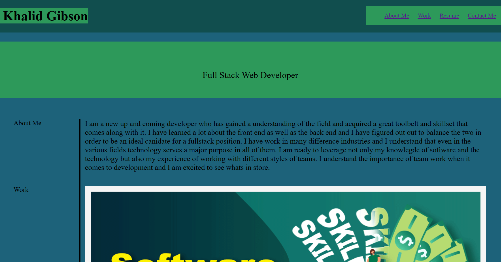

# Portfolio

## Challenges in This Course

It has been stated that there are two types of challenges in this course. Each one leans towards preparation for real life scenarios that are likely to be encountered in the industry.

### Challenge Types

The two types of Challenges are the following:

* **On-thejob ticket** or **feature request**

Some assignments are assigned with starter code. This code is to be modified to completion.

* **Job-seeking coding assessments** or **take-home assignments** 

These assignments do not have starter code. This code must be built from scratch.

### Challenge Elements

Challenges follow a format that is considered best practice in general when it comes to software development and are commonly used. Teams that use **agile project management** to manage their work would be a good example. These elements a great tools to prepare for the workflow of a professional full-stack web developer.

* **User Story**: As a Full Stack Web Developer I WANT to highlight and provide clarity to the benefits of having Me as an Employee. I WANT to note that these are just a few of the many skillsets that I hold and upon further request More info can be obtained through easily accessible links provided. I made this Porfolio piece SO THAT it would be easy for Employers to see quickly all of the qualifying factors and be able to quickly make the right decision.

## Screenshot

