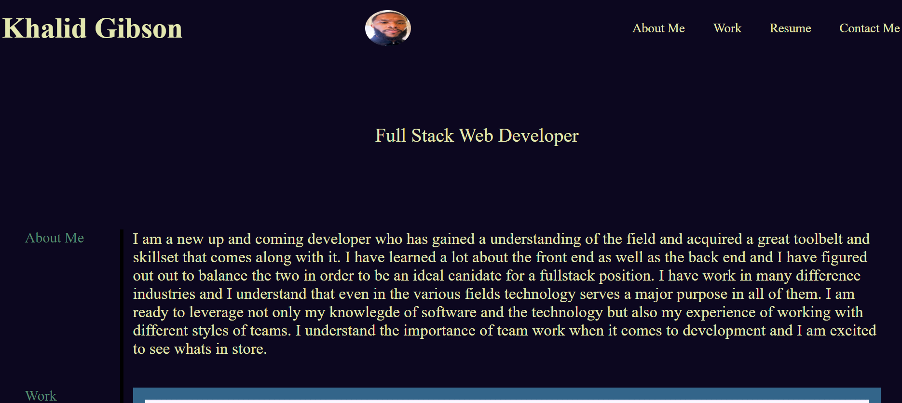
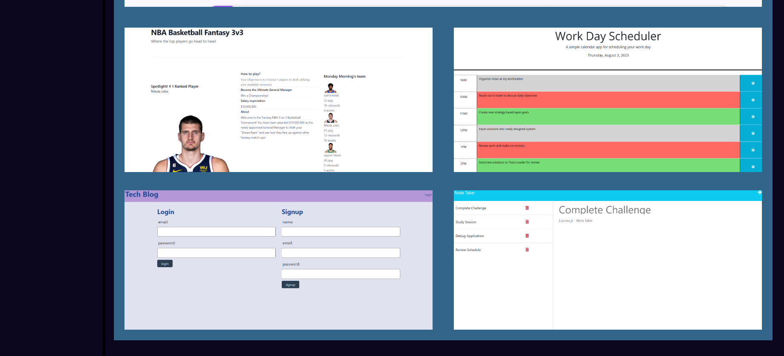

# Portfolio

## Challenges in This Course

It has been stated that there are two types of challenges in this course. Each one leans towards preparation for real life scenarios that are likely to be encountered in the industry.

### Challenge Types

The two types of Challenges are the following:

* **On-thejob ticket** or **feature request**

Some assignments are assigned with starter code. This code is to be modified to completion.

* **Job-seeking coding assessments** or **take-home assignments** 

These assignments do not have starter code. This code must be built from scratch.

## My Task

This assignment I was tasked build a portfolio from scratch. My portfolio displays the skills and talents that I would like to showcase to potential employers. Whether they are looking for full-time or part-time candidates this portfolio spotlights some key areas that effectively let employers know the benefits of hiring someone with my experience. It is said that students with deployed web applications do well in their career search after BootCamp. Having several deployed projects has been recommended and very often is a requirement for landing initial interviews. My portfolio that I have built from scratch is the first of many deployed applications that I have built and it does indeed showcase some of my projects completed and skills learned.

You will see the use of skills like FlexBox, media queries, and CSS variables. These skills are often used on the job and this challenge has provided a great opportunity to not only show off those skills but more importantly practice them and solidify the concepts.

## User Story

```
AS AN a new Developer
I WANT to show potential employers my deployed portfolio of work samples
SO THAT I they can review samples of my work and confirm that I am a great candidate for an open position
```

## Acceptance Criteria

The following requirements are necessities to developing a portfolio that typically satisfy a  hiring manager’s needs:

```
GIVEN potential employers need to view previous work
WHEN they load my portfolio
THEN they are presented with my name, a recent photo, and links to sections about me, my work, and how to contact me as well
WHEN clicking on the links in the navigation
THEN the UI scrolls to the corresponding section
WHEN they click on the link to the section about my work
THEN the UI scrolls to a section with titled images of my applications
WHEN presented with the my first application
THEN that application's image should be larger in size than the others
WHEN clicking on the images of the applications
THEN they are taken to that deployed application
WHEN resizing the page or view the site on various screens and devices
THEN they are presented with a responsive layout that adapts to their viewport
```

## Mock-Up

The following animation was provided to me to show an example of a web application's appearance and functionality:


## Review 

The following has been placed here to meet requirements for review:


Refer to this link [Deployed Application](https://thekhalidgibson.github.io/Portfolio/) to view and explore the application and functions on deployed site

Refer to this link [GitHub Repository](https://github.com/TheKhalidGibson/Portfolio) to view and explore the GitHub repo for this assignment


## Screenshots

The following images reflect the functionality and final results of development for this deployed application:





